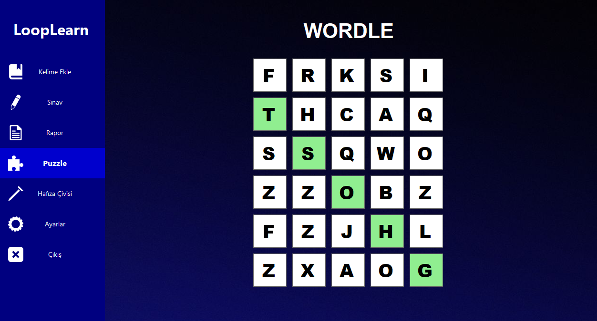

# LoopLearn

LoopLearn, İngilizce kelime öğrenimini kolaylaştırmak için geliştirilen bir uygulamadır. Klasik ezber yöntemlerinden farklı olarak, kelimeleri "6 adım" tekniğiyle pekiştirir. Bu teknik sayesinde bir kelime, aralıklı zamanlarda 6 kez doğru bilinirse o kelimenin öğrenildiği kabul edilir.

## Giriş Ekranı
Giriş Yap: Kullanıcı adı ve şifre ile giriş yapılabilir.

Üye Ol: Kullanıcı adı, şifre ve seçilen bir güvenlik sorusuna verilen cevap ile kayıt olunur.

Şifremi Unuttum: Kullanıcı adı ve güvenlik sorusu cevabıyla yeni bir şifre belirlenebilir.

## Uygulama İçeriği
## Kelime Ekleme Modülü
Kendi kelime sözlüğünü oluştur!
İngilizce kelime, Türkçesi, örnek bir cümle ve istersen kelimeye dair bir görselle birlikte uygulamaya eklenebilir.

## Sınav Modülü
“6 adım” algoritmasıyla hazırlanmış testleri çözerek kelimelerini pekiştir.
Bu sistem, öğrenilen kelimelerin zamanla hafızada kalıcı olmasını sağlar.

## Ayarlar Modülü
Günlük kaç kelimenin sınav havuzuna dahil olacağı belirlenir.

## Puzzle Modülü
Tamamen senin önceden öğrendiğin kelimelerden oluşan bir mini oyun.

## Rapor Modülü
Bugüne kadar kaç test sorusu çözdün?
Kaç tanesini doğru bildin?
Kaç kelimeyi oyunlarla pekiştirdin?
Tüm bu verileri görebilir ve çıktısını alabilirsin.

