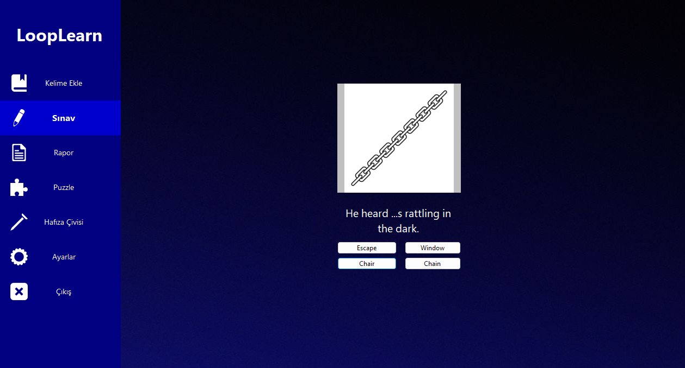

# LoopLearn

LoopLearn, İngilizce kelime öğrenimini kolaylaştırmak için geliştirilen bir uygulamadır. Klasik ezber yöntemlerinden farklı olarak, kelimeleri "6 adım" tekniğiyle pekiştirir. Bu teknik sayesinde bir kelime, aralıklı zamanlarda 6 kez doğru bilinirse o kelimenin öğrenildiği kabul edilir.

## Giriş Ekranı
Uygulama ilk açıldığında seni şu seçenekler karşılar:

Giriş Yap: Sadece kullanıcı adı ile giriş yapılabilir.

Üye Ol: Kullanıcı adı, şifre ve seçilen bir güvenlik sorusuna verilen cevap ile kayıt olunur.

Şifremi Unuttum: Kullanıcı adı ve güvenlik sorusu cevabıyla yeni bir şifre belirlenebilir.

## Uygulama İçeriği
Kelime Ekleme Modülü
Kendi kelime sözlüğünü oluştur!
İngilizce kelime, Türkçesi, örnek bir cümle ve istersen kelimeye dair bir görselle birlikte uygulamaya eklenebilir.

## Sınav Modülü
“6 adım” algoritmasıyla hazırlanmış testleri çözerek kelimelerini pekiştir.
Bu sistem, öğrenilen kelimelerin zamanla hafızada kalıcı olmasını sağlar.

## Ayarlar Modülü
Günlük kaç kelimenin sınav havuzuna dahil olacağını sen belirle.

## Puzzle Modülü
Wordle tarzı bir mini oyun!
Tamamen senin önceden öğrendiğin kelimelerden oluşan bir kelime bulmacası seni bekliyor.

## Rapor Modülü
Bugüne kadar kaç test sorusu çözdün?
Kaç tanesini doğru bildin?
Kaç kelimeyi oyunlarla pekiştirdin?
Tüm bu verileri görebilir ve çıktısını alabilirsin.

